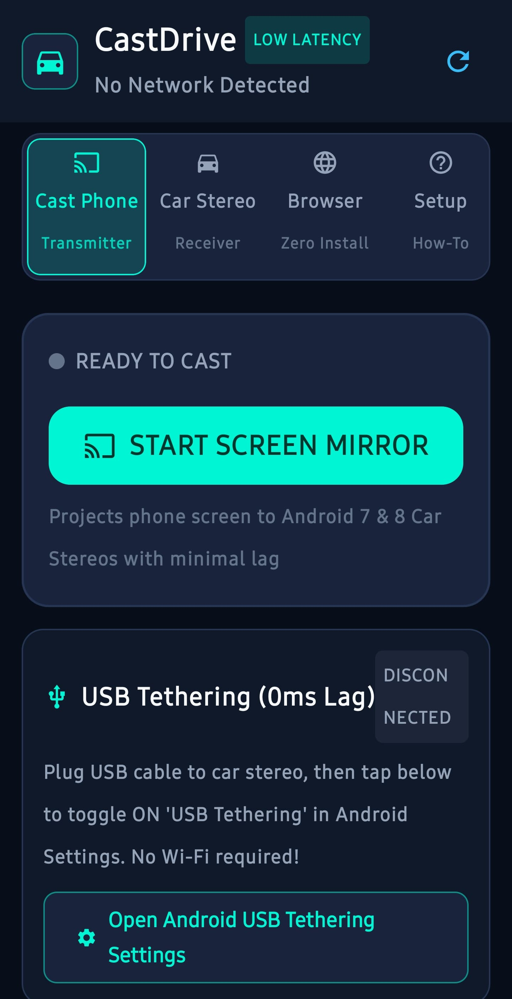
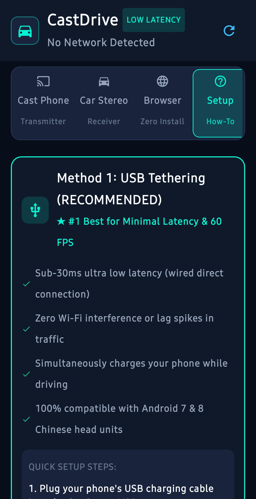
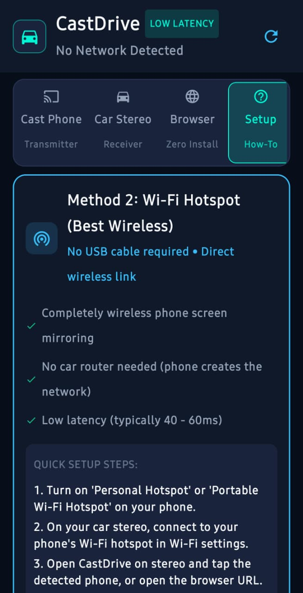
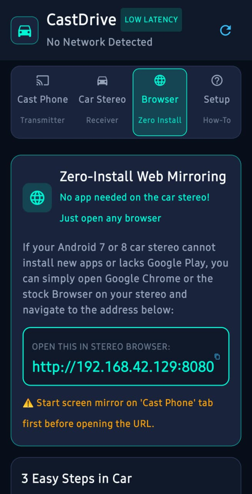
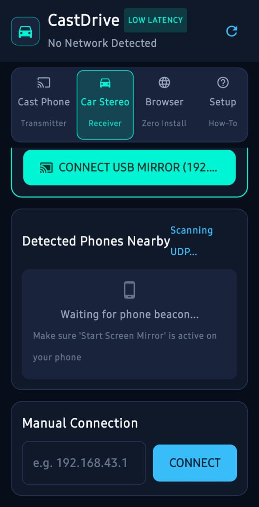
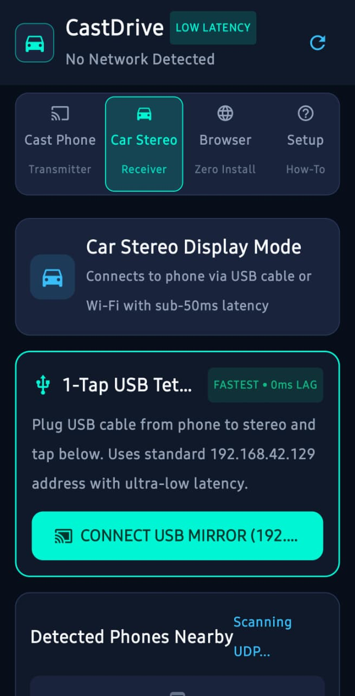
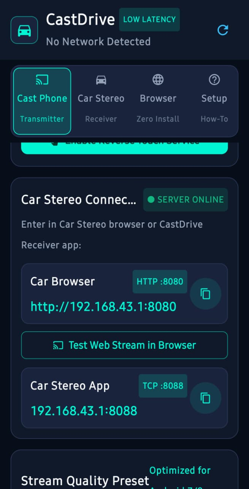
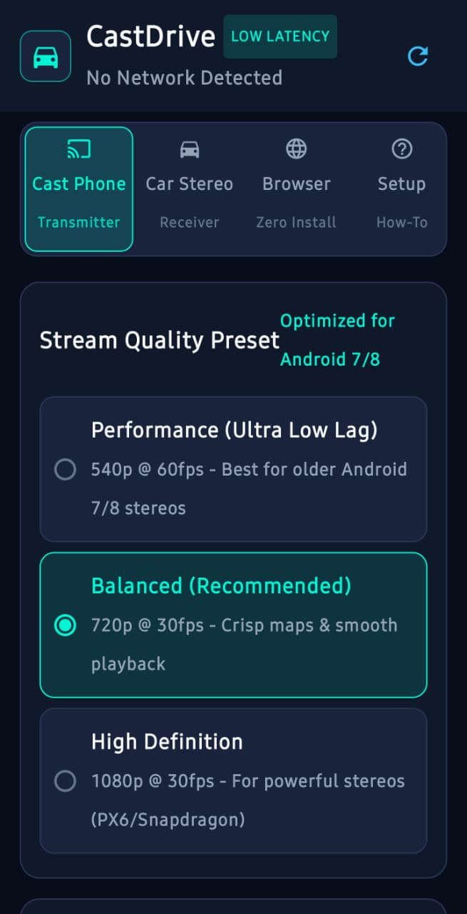

<p align="center">
  
  
  
  
</p>

<p align="center">
  
  
  
  
</p>

## 📥 Download

**Latest release: CastDrive v1.0.0**

[⬇️ Download CastDrive v1.0.0](../../releases/latest)

## 🎬 CastDrive Demo

[▶️ Watch CastDrive Demo](./CastDrive.mp4)


# CastDrive

### Android screen mirroring for cars, Android devices and browsers

**CastDrive v1.0.0** is an Android screen-mirroring project designed to turn an Android phone into a real-time streaming transmitter and another Android device, car head unit, tablet, phone, TV, or compatible web browser into a receiver.

The project started as an experiment to make practical, low-latency phone-to-car screen mirroring and gradually evolved through approximately **20 development iterations** involving new features, real-device testing, debugging, performance improvements, UI changes, networking changes, audio testing, touchscreen control, USB tethering, browser-based receiving, and Android Auto experiments.

> **CastDrive was developed entirely from an Android phone using Google AI Studio, without using a PC or Android Studio during the main development process.**

The project is an example of an AI-assisted, phone-first Android development workflow where the human developer directed the project, selected features, tested the application on real hardware, identified problems, and repeatedly guided fixes and improvements.

---

## 🚀 What is CastDrive?

CastDrive is built around a simple idea:

**Your phone is the transmitter. Another screen becomes the receiver.**

Possible receiver environments include:

- 🚗 Android car stereos / head units
- 📱 Another Android phone
- 📱 Android tablets
- 📺 Compatible Android devices
- 💻 Computers through a web browser
- 🌐 Compatible browsers on devices connected to the same network
- 🚘 Android Auto — **Experimental**

The project originally focused on automotive use, but testing showed that the underlying mirroring system can also be useful for general Android-to-device and browser-based screen streaming.

---

# ✨ Features

## 1. Native Android Receiver

The native receiver is the primary CastDrive receiver experience.

A second Android device can run CastDrive as a receiver while the original phone transmits its screen.

### Features

- Real-time screen streaming
- Low-latency video transmission
- Native Android receiver interface
- Fullscreen display
- Aspect-ratio controls
- Display rotation controls
- Touch interaction
- Connection status
- Automotive-oriented controls
- Compatibility with a range of Android receiver devices depending on hardware and Android version

---

# 🖐️ Reverse Touch Control

CastDrive supports **reverse touchscreen control** in both its native Android receiver and web-browser receiver modes.

Normally, screen mirroring is one-way:

```text
PHONE
  │
  │ Screen
  ▼
RECEIVER
```

CastDrive can make it two-way:

```text
             Screen
PHONE ───────────────────► RECEIVER
  ▲                           │
  │                           │ Touch
  └───────────────────────────┘
```

The receiver can send touchscreen interactions back to the phone.

Depending on the receiver and Android configuration, this can include:

- Tap
- Drag
- Swipe
- Back
- Home
- Recents/system actions

The feature uses Android's Accessibility framework and does not require root.

### Browser limitation

**Reverse touch works through the web-browser receiver in the tested configuration.**

Browser reverse touch has been tested successfully, although availability can vary with the browser, receiving device, Android version, and connection configuration.

Therefore:

| Receiver | Reverse Touch |
|---|---|
| Native Android receiver | ✅ Works where supported |
| Browser receiver | ✅ Works in the tested configuration |

This is an intentional limitation of the browser architecture rather than a missing browser setting.

---

# 🔊 Internal Audio Mirroring

CastDrive supports internal device audio capture and streaming in supported native receiver configurations.

This allows supported Android devices to send:

```text
PHONE
 ├── Screen
 └── Internal Audio
          │
          ▼
      RECEIVER
```

Audio support depends on Android's audio-capture system, device restrictions, the application being mirrored, and the receiver configuration.

### Browser limitation

**Internal audio mirroring works through the web-browser receiver in the tested configuration.**

Browser audio has been tested successfully, although availability can vary with the browser, receiving device, Android version, and connection configuration.

Therefore:

| Receiver | Internal Audio |
|---|---|
| Native Android receiver | ✅ Works where supported |
| Browser receiver | ✅ Works in the tested configuration |

Audio works through the supported native connection methods, subject to Android/device restrictions.

---

# 📐 Display Controls

The receiver interface includes controls designed for different screens and car installations.

Available controls include:

- **Fit**
- **Fill**
- **Fullscreen**
- **0° rotation**
- **90° rotation**
- **180° rotation**
- **270° rotation**

These controls are particularly useful for car head units because their screens can have different aspect ratios and orientations.

---

# ⚡ USB Tethering

USB tethering is supported, but it is currently considered **slightly experimental** compared with the other connection methods.

The basic concept is:

```text
PHONE
  │
  │ USB cable
  ▼
CAR / ANDROID RECEIVER
```

USB tethering creates a direct local network connection between the phone and receiver.

This can reduce dependence on external Wi-Fi infrastructure and can provide a useful low-latency connection.

### Current status

**USB tethering: ⚠️ Experimental / Working**

It has been tested successfully, but behavior can depend on:

- Phone model
- Android ROM
- USB configuration
- Receiver hardware
- USB cable
- Tethering implementation
- Network configuration

Because of this, USB tethering is not described as universally guaranteed.

---

# 📡 Wi-Fi Hotspot Mode

CastDrive can work using the phone's Wi-Fi hotspot.

Basic setup:

```text
             Wi-Fi Hotspot
PHONE ─────────────────────► RECEIVER
  │                              │
  └──── Screen + supported ─────┘
             Audio
```

This is useful when:

- USB is inconvenient
- The receiver supports Wi-Fi
- A wireless connection is preferred
- The phone is acting as the local network

---

# 📶 Local Wi-Fi Mode

CastDrive can also operate when the transmitter and receiver are connected to the same local Wi-Fi network.

The project includes UDP-based discovery functionality to help devices discover each other on the local network.

Example:

```text
          Wi-Fi Network
          /           \
         /             \
      PHONE           RECEIVER
        │                 │
        └── CastDrive ────┘
```

This can be useful for:

- Phones
- Tablets
- Android TV-style devices
- Computers
- Other compatible Android hardware

---

# 🌐 Browser Receiver

One of the major expansions of CastDrive was the **browser receiver**.

The receiving device does not need the CastDrive Android application installed.

Instead, a compatible web browser can open the CastDrive web receiver using the local address provided by the application.

Example:

```text
http://<phone-ip>:8080
```

### Browser receiver features

- Zero-install receiver
- Web-based video playback
- Fullscreen
- Aspect-ratio controls
- Rotation controls
- Automotive-oriented interface
- Compatible with supported browsers on the same network

### Browser receiver limitations

The browser receiver supports:

- ✅ Screen/video display
- ✅ Reverse touchscreen control (tested configuration)
- ✅ Internal audio mirroring (tested configuration)

These features have been tested successfully, but browser/device compatibility can vary. The browser receiver should therefore be considered supported in the tested configuration rather than universally guaranteed.

---

# 💻 Phone → PC Browser

Because the receiver is browser-based, a computer can also act as a receiver.

```text
ANDROID PHONE
      │
      │ Local network
      ▼
   PC BROWSER
```

No dedicated CastDrive PC application is required.

This is useful for:

- Testing
- Demonstrations
- Development
- Secondary displays
- Computers without a native receiver

---

# 📱 Phone → Phone

CastDrive can also be used between Android phones.

```text
Phone A
  │
  │ CastDrive
  ▼
Phone B
```

Phone B can act as the receiver.

This provides a convenient way to test CastDrive without a car head unit.

---

# 🚗 Automotive Focus

Although CastDrive can be used for general screen mirroring, the project was originally designed with Android car head units in mind.

Automotive-oriented development included:

- Large touchscreen controls
- Fullscreen mirroring
- Rotation support
- Aspect-ratio support
- USB tethering
- Reverse touchscreen control
- Internal audio
- Connection status
- Simple receiver controls
- Testing with Android car hardware

The goal was not simply to create another generic casting application.

The goal was to make something practical for Android-based car displays while keeping the underlying system flexible enough for other receivers.

---

# 🚘 Android Auto — EXPERIMENTAL

## ⚠️ Important

**Android Auto support is experimental in CastDrive v1.0.0.**

It should **not** be considered a fully supported or guaranteed Android Auto feature.

During development, CastDrive was tested with Android Auto, Headunit Reloaded, multiple phones, and different Android Auto surfaces.

The behavior was inconsistent.

For example, the application could appear in some Android Auto contexts while behaving differently when launched from another Android Auto surface.

A particularly important observation during testing was that CastDrive could show a mirroring experience in an Android Auto dashboard context while a media-player-related interface could appear when accessing the application through the Android Auto app drawer.

This means the Android Auto behavior depends heavily on the host environment and the surface from which the application is opened.

### Current status

| Feature | Status |
|---|---|
| Native Android receiver | ✅ Working |
| Browser receiver | ✅ Working |
| Wi-Fi hotspot | ✅ Working |
| Local Wi-Fi | ✅ Working |
| Screen mirroring | ✅ Working |
| Reverse touch | ✅ Working where supported |
| Internal audio | ✅ Working where supported |
| USB tethering | ⚠️ Experimental |
| Android Auto | ⚠️ Experimental |

### Why is Android Auto experimental?

Android Auto is not simply another Android screen.

Applications interact with Android Auto through supported automotive application models and host behavior.

CastDrive's primary purpose is real-time screen mirroring, which does not map perfectly onto the normal Android Auto application model.

Therefore, Android Auto is retained as an experimental feature while the core CastDrive receiver remains independent of it.

> **Do not assume Android Auto compatibility simply because CastDrive installs successfully.**

---

# 🧪 Development Journey

CastDrive was not created as one giant application in a single generation.

It evolved through approximately **20 development iterations**.

An iteration could include:

- Adding a feature
- Fixing a bug
- Changing networking
- Improving the receiver
- Testing audio
- Fixing touchscreen input
- Improving the UI
- Testing USB
- Testing Wi-Fi
- Testing Android Auto
- Fixing Android compatibility
- Changing Android service configuration
- Testing on another phone
- Testing on a car head unit
- Improving performance

The overall development loop looked like:

```text
IDEA
  ↓
IMPLEMENT
  ↓
BUILD
  ↓
INSTALL
  ↓
REAL DEVICE TEST
  ↓
PROBLEM FOUND
  ↓
DEBUG
  ↓
FIX
  ↓
TEST AGAIN
  ↓
NEXT ITERATION
```

Approximately 20 cycles of this process led to v1.0.0.

---

# 🧭 Development Evolution

The exact internal numbering of every iteration was not maintained as a formal changelog, but the project evolved approximately through these stages.

## Stage 1 — Initial Concept

The original idea was to create phone-to-car screen mirroring.

The main question was:

> Can an Android phone become a practical transmitter for an Android car display?

---

## Stage 2 — Basic Screen Mirroring

The first major goal was getting the phone display captured and transmitted to another device.

The basic pipeline became:

```text
Android Display
      ↓
MediaProjection
      ↓
Capture / Processing
      ↓
Network
      ↓
Receiver
      ↓
Displayed Screen
```

---

## Stage 3 — Native Receiver

The project expanded from basic streaming into a proper Android receiver with its own controls.

---

## Stage 4 — Touchscreen Interaction

Reverse touch control was introduced.

This changed the concept from simply:

> "Watch my phone on another screen"

to:

> "Interact with my phone from the receiving touchscreen."

---

## Stage 5 — Audio

Internal audio capture and transmission were introduced.

The goal became synchronized screen and supported audio mirroring.

---

## Stage 6 — Display Controls

Aspect ratio, fullscreen, and rotation controls were added.

---

## Stage 7 — Wi-Fi Networking

Wireless connections were added so the project would not depend only on physical cables.

---

## Stage 8 — Device Discovery

UDP discovery was introduced to simplify finding transmitter and receiver devices on a local network.

---

## Stage 9 — USB Tethering

USB tethering was developed and tested as another connection path.

It works, but remains slightly experimental because USB networking behavior varies between devices.

---

## Stage 10 — Browser Receiver

The browser receiver was introduced.

This allowed compatible devices to receive the stream without installing another Android application.

This significantly expanded the possible receiver hardware.

---

## Stage 11 — Android Auto Experiments

Android Auto integration was explored.

This involved experimenting with automotive services, media-related components, Android Auto host behavior, and different Android Auto surfaces.

---

## Stage 12+ — Real Hardware Testing

The project was repeatedly tested on real hardware.

Testing included:

- Android phone
- Second Android phone
- Android car head unit
- Headunit Reloaded
- USB connection
- Wi-Fi hotspot
- Browser receiver
- Touch input
- Audio
- Android Auto

Real hardware testing exposed problems that would not necessarily appear during code generation alone.

---

# 🤖 AI-Assisted Development

CastDrive was developed using an AI-assisted workflow.

The main development environment was:

**Google AI Studio on an Android phone.**

The main development process did not require a PC or Android Studio.

AI was used to assist with:

- Generating code
- Explaining Android APIs
- Debugging errors
- Suggesting architecture
- Implementing features
- Reviewing configuration
- Investigating problems
- Modifying Android services
- Iterating on UI
- Troubleshooting builds

However, CastDrive was not simply generated once and published.

The development process required continuous human direction.

The developer:

- Defined the original concept
- Selected features
- Tested builds on physical hardware
- Identified failures
- Reported real-world behavior
- Decided which changes to keep
- Rejected changes that broke working features
- Repeated testing after modifications
- Decided when the project was ready for v1.0.0

The workflow was therefore:

```text
Human idea
    ↓
AI-assisted implementation
    ↓
Human testing
    ↓
Real-world problem
    ↓
AI-assisted debugging
    ↓
Human decision
    ↓
New build
    ↓
Repeat
```

---

# 🧠 Why Iteration Was Important

AI-generated code can look correct while still failing on real hardware.

Android has many variables:

- Different Android versions
- Different manufacturers
- Different permissions
- Different networking configurations
- Different display resolutions
- Different Accessibility behavior
- Different car head units
- Different Android Auto hosts
- Different browsers
- Different audio implementations

A feature that works on one device may behave differently on another.

Real-device testing was therefore a major part of CastDrive's development.

A useful summary of the process is:

```text
Code says:
"Should work."

Hardware says:
"Let's find out."
```

---

# 🧪 Testing

CastDrive was tested as a real application rather than only as source code.

Testing focused on:

## Transmitter

- Screen capture
- Video streaming
- Audio capture
- Network connection
- Performance
- Permissions

## Native Receiver

- Video playback
- Fullscreen
- Rotation
- Aspect ratio
- Touchscreen input
- Connection handling
- Audio

## Browser Receiver

- Video playback
- Browser connection
- Fullscreen
- Rotation
- Aspect ratio

The browser receiver was also specifically tested to determine which native features were unavailable through the browser.

Result:

- Video/display: ✅
- Reverse touch: ✅
- Internal audio: ✅

## Networking

- USB tethering
- Wi-Fi hotspot
- Local Wi-Fi
- Device discovery

## Automotive

- Android car head units
- Touchscreen interaction
- Large displays
- Android Auto
- Headunit Reloaded

---

# 📊 Current Feature Matrix

| Feature | Native Android Receiver | Browser Receiver |
|---|---:|---:|
| Screen mirroring | ✅ | ✅ |
| Video streaming | ✅ | ✅ |
| Fullscreen | ✅ | ✅ |
| Aspect ratio | ✅ | ✅ |
| Rotation | ✅ | ✅ |
| Reverse touch | ✅ | ✅* |
| Internal audio | ✅* | ✅* |
| USB networking | ⚠️ | ⚠️ |
| Wi-Fi hotspot | ✅ | ✅ |
| Local Wi-Fi | ✅ | ✅ |
| Phone → phone | ✅ | — |
| Phone → PC | — | ✅ |
| Android Auto | ⚠️ Experimental | — |

`*` Audio depends on Android/device/application support.

---

# ⚠️ Known Limitations

## Browser Receiver

The browser receiver supports screen/video display, reverse touch, and internal audio in the tested configuration.

Because browser and device capabilities can vary, these features are not described as universally guaranteed across every browser, Android version, or receiving device.

---

## USB Tethering

USB tethering works but remains **slightly experimental**.

Compatibility can vary depending on the phone, Android version, ROM, USB cable, receiver and network configuration.

---

## Android Auto

Android Auto integration remains **experimental**.

Behavior may vary between:

- Vehicles
- Android Auto versions
- Phones
- Headunit Reloaded
- Android Auto launcher surfaces

---

## Audio

Internal audio capture depends on Android's audio-capture support.

Some applications or Android versions may restrict audio capture.

---

## Accessibility

Reverse touch requires Android Accessibility functionality.

The user must explicitly enable the required Accessibility service.

---

## Network Performance

Mirroring performance depends on:

- Wi-Fi quality
- USB connection
- Receiver hardware
- Phone hardware
- Resolution
- Encoding load
- Network congestion
- Android background restrictions

Low latency does not mean identical performance on every device.

---

# 🔐 Privacy

CastDrive is designed around local device-to-device communication.

The core mirroring system is intended to transmit the screen and supported audio between devices rather than relying on a remote streaming service.

Users should remember:

> When screen mirroring is active, anything displayed on the phone may be visible on the receiver.

Only mirror to receivers you trust.

---

# 🔒 Permissions

CastDrive uses Android capabilities required for its operational features.

Depending on the features being used, these include:

### MediaProjection

Used to capture the phone display.

### Foreground Service

Used to keep mirroring active while the service is running.

### Accessibility Service

Used for reverse touchscreen interaction.

This is optional and is only needed when reverse touch is being used.

### Audio Capture

Used for internal device audio capture where Android permits it.

### Network Access

Used for:

- Screen streaming
- Audio streaming
- Device discovery
- Browser receiver
- USB networking
- Wi-Fi networking

---

# 🌐 Network Requirements

CastDrive's core local mirroring does not require a conventional internet connection between the transmitter and receiver.

Depending on the connection method, devices can communicate through:

- USB tethering
- Phone hotspot
- Local Wi-Fi

Internet connectivity and local-network connectivity are not the same thing.

---

# 🚗 Example Automotive Setup

A typical Android car setup can look like:

```text
                 USB / Wi-Fi
Phone ─────────────────────────► Android Car Stereo
 │                                      │
 │              CastDrive               │
 └──────────────────────────────────────┘
```

The phone runs the transmitter.

The Android car stereo runs the receiver.

When supported, the car touchscreen can send touch interactions back to the phone.

---

# 🌐 Example Browser Setup

```text
Phone
 │
 │ Local network
 ▼
Computer / Tablet / Car Browser
 │
 └── Open CastDrive receiver page
```

The browser displays the mirrored video.

Reverse touch and internal audio also work in the tested browser configuration.

---

# 📱 Example Phone-to-Phone Setup

```text
Phone A
  │
  │ CastDrive
  ▼
Phone B
```

Phone B becomes the receiver.

This is also useful for testing.

---

# 🎯 Project Goals

The main goals of CastDrive are:

- Create practical Android screen mirroring
- Support automotive Android displays
- Keep latency low
- Provide touchscreen control where native Android capabilities allow it
- Support internal audio where Android allows it
- Support multiple connection methods
- Provide a browser receiver
- Work across different types of Android hardware
- Experiment with Android Auto
- Explore what can be built entirely from a phone using AI-assisted development

---

# 🛠️ What CastDrive Is NOT

CastDrive does not claim universal compatibility with every:

- Android phone
- Android tablet
- Android TV device
- Car stereo
- Browser
- Android Auto system
- Android version
- Wi-Fi network

Android implementations vary considerably.

Compatibility should therefore be considered **device-dependent**.

---

# 📦 Project Information

**Application:** CastDrive

**Version:** `1.0.0`

**Package ID:**

```text
com.aistudio.automirror.cxkmv
```

**Minimum Android SDK:** `24`

**Target Android SDK:** `36`

**Main development environment:**

```text
Android phone
+
Google AI Studio
+
AI-assisted development
+
Real-device testing
```

---

# 📈 Why v1.0.0?

The project went through approximately **20 iterations**.

At some point, continuously adding features becomes less useful than stabilizing what already works.

v1.0.0 is therefore a milestone:

> The core mirroring system is functional enough to release as a real project, while USB tethering and Android Auto remain experimental and browser-specific limitations are documented clearly.

Future versions can focus on:

- Bug fixes
- Compatibility improvements
- Performance improvements
- UI improvements
- Additional receiver support
- Better documentation
- Further Android Auto research
- New connection methods
- Android version compatibility

---

# 🗺️ Possible Future Development

Possible future directions include:

- Better low-latency encoding
- More receiver devices
- Improved automatic discovery
- Improved reconnect behavior
- Better audio synchronization
- More touchscreen actions
- Improved automotive UI
- Additional display controls
- Better device compatibility
- Better Android Auto investigation
- More detailed diagnostics
- Connection quality indicators
- Improved error messages

These are possibilities, not promises.

---

# 🏁 Development Milestone

CastDrive demonstrates a different way of approaching Android software development.

Instead of:

```text
Idea → Code → Release
```

the project followed:

```text
Idea
 ↓
AI-assisted coding
 ↓
Build
 ↓
Real hardware
 ↓
Test
 ↓
Find problem
 ↓
Fix
 ↓
Improve
 ↓
Test again
 ↓
Repeat
 ↓
~20 iterations
 ↓
v1.0.0
```

The result is not just an APK.

It is the result of repeatedly taking an idea, turning it into software, testing it against real hardware, discovering what works and what does not, and improving it.

---

# 👨‍💻 Development Story

CastDrive was created primarily from an Android phone.

There was no traditional:

```text
PC
 ↓
Android Studio
 ↓
Emulator
 ↓
Build
```

workflow for the main development process.

Instead:

```text
Android Phone
      ↓
Google AI Studio
      ↓
AI-assisted implementation
      ↓
Build
      ↓
Install on real hardware
      ↓
Test
      ↓
Report problems
      ↓
Modify project
      ↓
Build again
```

This phone-first workflow made CastDrive both a software project and an experiment in modern AI-assisted development.

---

# 🤖 Human + AI Development

CastDrive was created with AI assistance, but the development process still depended on human decisions and testing.

AI assisted with:

- Code generation
- Debugging
- Explanations
- Android implementation
- Configuration
- Feature implementation
- Troubleshooting

The human developer handled:

- Product idea
- Feature selection
- Testing
- Hardware setup
- Real-world observations
- Iteration decisions
- Debugging direction
- Feature prioritization
- Release decisions

The project is therefore best described as:

> **AI-assisted software development directed and tested by a human developer.**

---

# 📜 Iteration Philosophy

The project deliberately followed an iterative approach.

Instead of trying to design the perfect application before testing it, features were built and tested progressively.

This exposed problems that could not easily be predicted from source code alone.

For example:

```text
Code:
"Feature should work."

Real hardware:
"Not quite."
```

That difference is one of the main reasons the project went through so many iterations.

---

# ⭐ v1.0.0 Summary

| Area | Status |
|---|---|
| Screen mirroring | ✅ Working |
| Native Android receiver | ✅ Working |
| Browser receiver | ✅ Working |
| Phone → phone | ✅ Working |
| Phone → browser | ✅ Working |
| Phone → car Android head unit | ✅ Working |
| Wi-Fi hotspot | ✅ Working |
| Local Wi-Fi | ✅ Working |
| USB tethering | ⚠️ Slightly Experimental |
| Reverse touchscreen | ✅ Working where supported |
| Browser reverse touch | ✅ Working in tested configuration |
| Internal audio | ✅ Working where supported |
| Browser internal audio | ✅ Working in tested configuration |
| Rotation | ✅ Working |
| Aspect ratio | ✅ Working |
| Fullscreen | ✅ Working |
| Android Auto | ⚠️ Experimental |

---

# 📥 Installation

Download the APK from the **GitHub Releases** section.

Install CastDrive on the Android device that will act as the transmitter.

For native receiving, install CastDrive on the compatible receiving Android device as well.

For browser receiving, the receiver can instead use a compatible web browser.

> Android may display security warnings when installing APKs outside Google Play. Only install builds from a source you trust.

---

# 🚘 Basic Car Setup

## Option A — USB Tethering

1. Connect the phone to the Android car stereo.
2. Enable USB tethering on the phone.
3. Open CastDrive.
4. Start the transmitter.
5. Open the receiver on the car stereo.
6. Connect using the USB network connection.

> USB tethering is currently slightly experimental.

---

## Option B — Wi-Fi Hotspot

1. Enable the phone's hotspot.
2. Connect the car stereo to the hotspot.
3. Open CastDrive on the phone.
4. Open the receiver on the car stereo.
5. Connect to the phone.

---

## Option C — Browser

1. Connect the receiver and phone to the same network.
2. Open a compatible browser on the receiver.
3. Open the CastDrive receiver address displayed by the application.
4. Start mirroring.

Browser receiving provides video/display plus reverse touch and internal audio in the tested configuration; availability can vary by browser and device.

---

# ⚠️ Safety

CastDrive is intended for testing and use when the vehicle is safely parked.

Do not interact with a mirrored phone interface while driving if doing so would distract you from operating the vehicle.

---

# 📄 License

MIT License

---

# 🙌 Credits

## Development

**CastDrive**

Developed using:

- Android
- Google AI Studio
- AI-assisted coding
- Real-device testing
- Android car hardware
- Browser receiver testing
- Multiple development iterations

---

# 💡 Why This Project Exists

CastDrive started with a simple question:

> **Could I build a practical Android screen-mirroring system for a car entirely from my phone?**

The answer became a much bigger project.

What began as screen mirroring developed into:

- Native receiving
- Browser receiving
- Reverse touchscreen control
- Internal audio
- USB tethering
- Wi-Fi networking
- Automatic discovery
- Automotive controls
- Android Auto experimentation

and approximately **20 development iterations**.

The project is therefore not only about the final APK.

It is also about the process of taking an idea, using AI as a development tool, testing it against real hardware, finding what breaks, fixing it, and repeating the cycle until something genuinely usable emerges.

---

# 🚀 Final Status

## CastDrive v1.0.0

**Core mirroring:** Working  
**Native receiver:** Working  
**Browser receiver:** Working  
**Wi-Fi:** Working  
**USB tethering:** Slightly Experimental  
**Touch:** Working where supported  
**Browser touch:** Working in tested configuration  
**Audio:** Working where supported  
**Browser audio:** Working in tested configuration  
**Android Auto:** Experimental

This is the first public milestone of CastDrive.

More importantly, it is the result of approximately **20 iterations of building, testing, breaking, fixing and rebuilding.**

---

## ⭐ If you try CastDrive

Feedback is welcome.

Useful reports should include:

- Phone model
- Android version
- Receiver device
- Connection method
- Whether video works
- Whether audio works
- Whether touch works
- Approximate latency/performance
- Any error messages

This information can help improve compatibility in future versions.

---

**CastDrive — Mirror your Android. Take it beyond the phone.**
